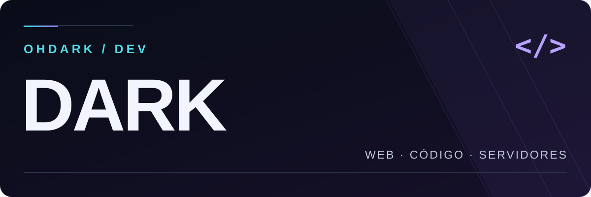

<p align="center">
  
</p>

<div align="center">

### Entre ideias, código e servidores.

**Marlon Verissimo** · por aqui, **OhDark**


</div>

---

## ⚡ Quem está por trás do código

Sou o **Marlon**, desenvolvo sites e exploro soluções para servidores. Gosto de transformar uma ideia em algo que dá para abrir, testar e usar.

Meu jeito de aprender é colocar a mão no código: criar, encontrar os problemas e melhorar a próxima versão. Interfaces organizadas, ferramentas úteis e troca de conhecimento fazem parte desse caminho.

<table>
<tr>
<td width="50%" valign="top">
<h3>🛠️ O que construo</h3>
<ul>
<li>Sites e páginas de apresentação.</li>
<li>Interfaces e ferramentas para a web.</li>
<li>Projetos voltados a servidores.</li>
</ul>
</td>
<td width="50%" valign="top">
<h3>🎯 Como evoluo</h3>
<ul>
<li>Aprendendo com projetos na prática.</li>
<li>Testando e ajustando cada solução.</li>
<li>Trocando ideias e conhecimento.</li>
</ul>
</td>
</tr>
</table>

## 💻 Tecnologias no caminho

Ferramentas presentes nos meus estudos e projetos.

<p align="center">
  
  
  
  <br>
  
  
  
</p>

## 🧩 Meu modo de trabalho

```javascript
const marlon = {
  alias: "OhDark",
  foco: ["Web", "Interfaces", "Servidores"],
  aprendizado: "Criar → testar → melhorar",
};
```

---

<div align="center">
  <strong>Uma ideia de cada vez. Uma versão melhor a cada passo.</strong>
  <br>
  <sub>Marlon Verissimo · OhDark</sub>
</div>
